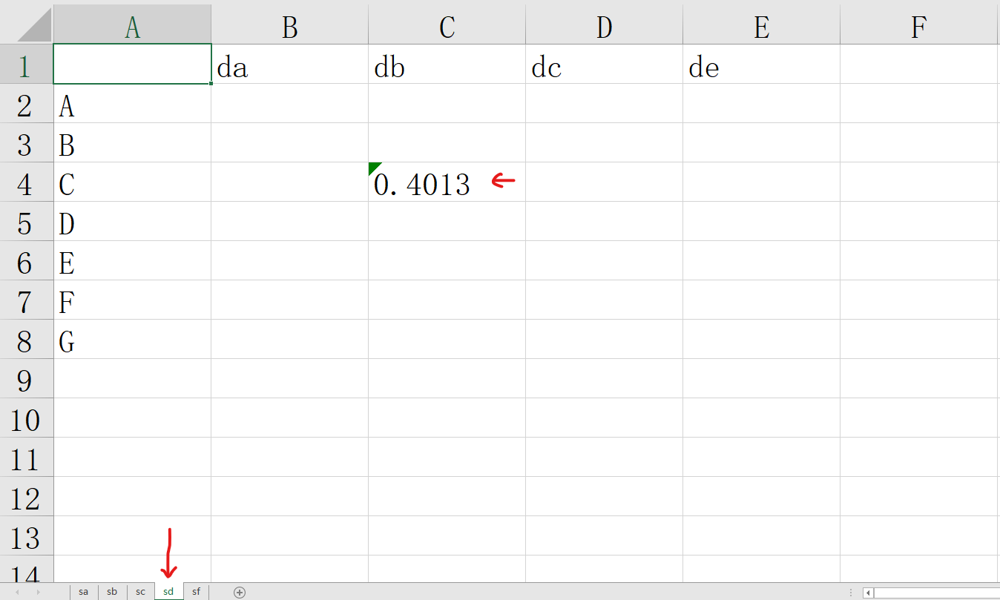

# CiLog

CiLog is a flexible integrated logging tool with color and custom bold font base on package logging.

## Feature

* Colored console outputs
* Setting stack info output level
* Easier way to custom format for each level
* Substitute builtins.print: a new print grammar to use log!
* Command line script to substitute `nohup cmd &` with a "task
completed reminder" feature.

## Install

```bash
$ pip install cilog
```

## New Features

### 1.2.0
* Add SUPPORT for excel table filling.
Usage:
```python
from cilog import fill_table


table_format = [['A', 'B', 'C', 'D', 'E', 'F', 'G'],
                ['da', 'db', 'dc', 'de'],
                ['sa', 'sb', 'sc', 'sd', 'sf']]

fill_table('./excel_test.xlsx', value='0.4013', x='C', y='db', z='sd', table_format=table_format)
```


### 1.1.5
* Add SUPPORT for error logging(such as `raise ***`), all the error message will go though the
logger.error process. Note that you have to use set flag `sub_print=True` in `create_logger()`
to use this function.
* Fix bug with package tqdm

### 1.1.4
* Tabular print SUPPORT: `print(f'#T#!latex{table_list}')` for latex format table string 
or `print(f'#T#{table_list}')` for markdown format table string.

### 1.1.3
* Bug fixed

### 1.1.2
* Automatically install dependencies when first running.

### 1.1.1
* bug fixed

### 1.1.0
* Add origin level. When we use sub_print=True, `print(f'string')` will act like normal builtin print
function. Other levels like `info`, `debug` and `mail`, etc, should be specified by special notation
like `#IN#`, `#D#` and `#M#`, etc.
* Support Table print in markdown format or latex format for data scientists.

### 1.0.2
* Bug fixed

### 1.0.1
* Bug fixed

### 1.0.0
* Develop print function substitute function. Now you can directly
send parameter `sub_print=True` to `create_logger` for substituting print.
* A command line TOOL: cilog is available NOW! You don't have
to use `nohup cmd &` any more! It will even send a EMAIL to you when your task
completed! Please refer to the main document for how to use it.


### 0.3.0
* Substitute builtins.print using logger.substitute_print()
* A brand NEW way to use logger! You can just use print()!
* By using print, you need to know the easier logger grammar. 
Please refer to the main document. 

### 0.2.1

* Bug fixed: Now the logger can automatically create the directory for log file.

### 0.2.0

* Eliminate ipt_info, instead you can use logger.important() to log important info.
* adding feature of sending email. By Default, after setting enable_mail and mail_setting, all message log by
logger.mail() will be sent to the specific email address according to mail_setting.

### 0.1.1

* After log file's line_length is greater than 1e+4, it will automatically backup the log file with localtime then new 
a log file.

### 0.1.0

* new parameter ipt_info

## Basic Usage

```python
from cilog import create_logger


def call_error():
    logger.error('Exception')

'''
mail_setting = {
            mailhost:   string or tuple - YourMailHost or (host, port),
            fromaddr:   string          - YourSenderAddress,
            toaddrs:    list(string)    - List of YourTargetAddresses,
            subject:    string          - Mail Subject,
            credentials:tuple           - (YourUsername, YourPassword),
            secure:     tuple           - () or (KeyfileName) or (KeyfileName, CertificatefileName)
                                            use the secure protocol (TLS),
            timeout:    float           - Default 1.0
        }
'''
# New Feature
mail_setting = {
    'mailhost': ('*****', int(**)),
    'fromaddr': '****@*****',
    'toaddrs': ['****@****', '***@***'],
    'subject': 'CiLog test',
    'credentials': ('***@**', '****')
}
logger = create_logger(name='l1', file='./log.log', use_color=True, enable_mail=True,
                       mail_setting=mail_setting)
logger.info('start')
logger.debug('here')
logger.warning('warn')
call_error()
logger.critical('Program exit.')
logger.important('lal')
logger.mail('test') # you will receive an email after using this function.
```

"*" means new features

`create_logger` keywords:

name : str - logger name

file : str - File path

file_mode : str - File open mode. Default: 'a'

file_level : Literal['DEBUG', 'INFO', 'WARNING', 'IMPORTANT', 'ERROR', 'CRITICAL', 'MAIL'] - Default 'INFO'

enable_mail : bool - Default False

mail_level : Literal['DEBUG', 'INFO', 'WARNING', 'IMPORTANT', 'ERROR', 'CRITICAL', 'MAIL'] - Default 'MAIL'

mail_setting : dir - Required if enable_mail == True
```
    {
        mailhost:   string or tuple - YourMailHost or (host, port),
        fromaddr:   string          - YourSenderAddress,
        toaddrs:    list(string)    - List of YourTargetAddresses,
        subject:    string          - Mail Subject,
        credentials:tuple           - (YourUsername, YourPassword),
        secure:     tuple           - () or (KeyfileName) or (KeyfileName, CertificatefileName)
                                        use the secure protocol (TLS),
        timeout:    float           - Default 1.0
    }
```
use_color : bool - Signal for using colored info. Default True

stack_level : Literal['DEBUG', 'INFO', 'WARNING', 'IMPORTANT', 'ERROR', 'CRITICAL', 'MAIL'] - Default 'ERROR'

msg_fmt : Dict{'DEBUG': debug_fmt, 'INFO': info_fmt, 'WARNING': warning_fmt, 'IMPORTANT': important_fmt,
'ERROR': error_fmt, 'CRITICAL': critical_fmt, 'MAIL': mail_fmt} - Custom design massage format.

(Specially, you can use $BOLD **text** $RESET to use bold font)
Please refer to CustomFormatter and url: https://docs.python.org/3/library/logging.html#logrecord-attributes

return: logger : CustomLogger

## Advance Usage

### Substitute builtins.print
The only step you shoud do is:
```python
from cilog import create_logger
create_logger(sub_print=True)

# Then: you can even execute the following scripts 
# in other files if only you have run these two lines
# in the same system process

# Let us just try!


print('i=1') # info: i=1
print('i', '=', '1') # info: i = 1
print('#D#Here!') # Debug: Here! [#d#, #DEbu#, #dEBug#, ... are all valid!]
print('#W#warning') # Warning ...
# Similarly, #e# #ER# ...: error, #I# #IM# ...: important,
# #C# #CRE# ...: critical, #M# #MA# #Mail# ...: mail.
```
**Grammar**: The way to use `logger.info` is just use `print`, and the way
to use other level is to **type the first several characters of the level 
name between simbol `#`**. 

You can use print everywhere which actually use the logger
you created to output! Meanwhile, you can use any `print` features,
like `end=*` or `sep=* ...` but do not use `file=*`, because the logger
only monitor the standard output.

**Elaborate Example:**

```python
from cilog import create_logger


def call_error():
    print('#E#Exception')

'''
mail_setting = {
            mailhost:   string or tuple - YourMailHost or (host, port),
            fromaddr:   string          - YourSenderAddress,
            toaddrs:    list(string)    - List of YourTargetAddresses,
            subject:    string          - Mail Subject,
            credentials:tuple           - (YourUsername, YourPassword),
            secure:     tuple           - () or (KeyfileName) or (KeyfileName, CertificatefileName)
                                            use the secure protocol (TLS),
            timeout:    float           - Default 1.0
        }
'''
mail_setting = {
    'mailhost': ('*****', int(**)),
    'fromaddr': '****@*****',
    'toaddrs': ['****@****', '***@***'],
    'subject': 'CiLog test',
    'credentials': ('***@**', '****')
}
create_logger(name='l1', file='./log.log', enable_mail=True,
                       mail_setting=mail_setting, sub_print=True)
# The simplest usage `create_logger(sub_print=True)`
print('origin')
table_list = [['Tox21', 'Clintox'], [1, 2], [3, 4]]
print(f'#t#{table_list}')   # print table in markdown format
# |   Tox21 |   Clintox |
# |--------:|----------:|
# |       1 |         2 |
# |       3 |         4 |

print(f'#t#!latex{table_list}') # latex format table
# \begin{tabular}{rr}
# \toprule
#  Tox21 &  Clintox \\
# \midrule
#      1 &        2 \\
#      3 &        4 \\
# \bottomrule
# \end{tabular}

print('#IN#start')
print('#D#here')
print('#W#warn')
call_error()
print('#C#Program exit.')
print('#IM#lal')
# print('#M#test')
```

### Command line usage

#### First step
Run `$ cilog [any cmd]` to create default config file at
`$HOME$/.cilog/config.json` then modify it with your custom
setting.

#### Run a cmd
For example:

```bash
$ cilog python my_algorithm.py --lr 0.01 --epoch 100
```
it is equal to:
```bash
$ nohup python my_algorithm.py --lr 0.01 --epoch 100 > cilog.log 2>&1 &
```

`-e` usage:
```bash
$ cilog -e python my_algorithm.py --lr 0.01 --epoch 100
```
There is no different to the previous example but will send you
A EMAIL when the task finished [Using your default setting]. 
It is especially useful when your program is time comsuming.

`-c [config_file]`: use your own config file instead of the default one.

`-r [redirect_file]`: redirect the output to a file instead of `cilog.log`.

Ps: Do not use the same cmdline parameters `-c -e -r` in your program,
or it will cause an error.

Help: `cilog --help`


## LICENSE

See [MIT LICENSE](https://github.com/CM-BF/CiLog/blob/master/LICENSE)
